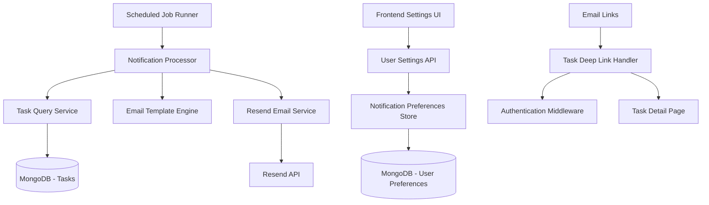

# Design Document

## Overview

The task email notifications feature extends the existing task management system to provide automated email reminders based on user-configurable preferences. The system integrates with Resend for reliable email delivery and includes a scheduled job system to process notifications daily. Users can configure notification timing (1 day before, 2 days before, same day, or combinations) and receive professionally formatted emails with direct task links.

## Architecture

### High-Level Architecture



### System Components

1. **Notification Scheduler**: Daily cron job that identifies tasks requiring notifications
2. **Notification Processor**: Core service that generates and sends email notifications
3. **Email Template Engine**: Generates HTML email content with task details
4. **Resend Integration Service**: Handles email delivery via Resend API
5. **User Preferences Service**: Manages notification timing preferences
6. **Deep Link Handler**: Processes email links to direct users to specific tasks

## Components and Interfaces

### Backend Components

#### 1. Notification Preferences Model
```javascript
// models/NotificationPreference.js
const notificationPreferenceSchema = new mongoose.Schema({
  userId: { type: mongoose.Schema.Types.ObjectId, ref: 'User', required: true, unique: true },
  emailNotificationsEnabled: { type: Boolean, default: true },
  notificationDays: [{
    type: String,
    enum: ['same_day', '1_day_before', '2_days_before'],
    default: ['1_day_before']
  }],
  timezone: { type: String, default: 'UTC' },
  createdAt: { type: Date, default: Date.now },
  updatedAt: { type: Date, default: Date.now }
});
```

#### 2. Email Notification Service
```javascript
// services/emailNotificationService.js
class EmailNotificationService {
  constructor(resendClient, templateEngine) {
    this.resend = resendClient;
    this.templateEngine = templateEngine;
  }

  async sendTaskReminder(user, task, notificationContext) {
    // Generate email content using template engine
    // Send via Resend with retry logic
    // Log delivery status
  }

  async sendBatchNotifications(notifications) {
    // Use Resend batch API for multiple notifications
  }
}
```

#### 3. Notification Scheduler
```javascript
// services/notificationScheduler.js
class NotificationScheduler {
  async processDaily() {
    // Query tasks that need notifications based on user preferences
    // Group notifications by user
    // Generate and send emails
    // Track sent notifications to prevent duplicates
  }

  async getTasksRequiringNotification(date) {
    // Complex query to find tasks based on due dates and user preferences
  }
}
```

#### 4. Deep Link Handler
```javascript
// middleware/deepLinkHandler.js
const handleTaskDeepLink = async (req, res, next) => {
  // Extract task ID and user context from link
  // Verify user has access to task
  // Redirect to task detail page or login
};
```

### Frontend Components

#### 1. Notification Settings Component
```typescript
// lib/components/settings/NotificationSettings.svelte
interface NotificationPreferences {
  emailNotificationsEnabled: boolean;
  notificationDays: NotificationDay[];
  timezone: string;
}

type NotificationDay = 'same_day' | '1_day_before' | '2_days_before';
```

#### 2. Notification Repository
```typescript
// lib/repositories/notifications.repository.ts
export class NotificationsRepository {
  async getPreferences(): Promise<NotificationPreferences>;
  async updatePreferences(preferences: NotificationPreferences): Promise<void>;
  async testNotification(taskId: string): Promise<void>;
}
```

## Data Models

### Notification Preferences Schema
```javascript
{
  _id: ObjectId,
  userId: ObjectId, // Reference to User
  emailNotificationsEnabled: Boolean,
  notificationDays: [String], // ['same_day', '1_day_before', '2_days_before']
  timezone: String, // User's timezone for accurate scheduling
  createdAt: Date,
  updatedAt: Date
}
```

### Notification Log Schema (for tracking sent notifications)
```javascript
{
  _id: ObjectId,
  userId: ObjectId,
  taskId: ObjectId,
  notificationType: String, // 'same_day', '1_day_before', '2_days_before'
  sentAt: Date,
  emailId: String, // Resend email ID
  status: String, // 'sent', 'failed', 'bounced'
  createdAt: Date
}
```

### Enhanced Task Model
```javascript
// Add to existing Task model
{
  // ... existing fields
  lastNotificationSent: Date, // Track when last notification was sent
  notificationsSent: [String] // Array of notification types already sent
}
```

## Error Handling

### Email Delivery Failures
- **Retry Logic**: Implement exponential backoff for transient failures
- **Dead Letter Queue**: Store failed notifications for manual review
- **Fallback Notifications**: Log critical failures for admin review
- **User Feedback**: Provide delivery status in user settings

### API Rate Limiting
- **Resend Limits**: Respect Resend API rate limits with queuing
- **Batch Processing**: Use Resend batch API for multiple notifications
- **Circuit Breaker**: Temporarily disable notifications if service is down

### Data Consistency
- **Duplicate Prevention**: Track sent notifications to prevent duplicates
- **Transaction Safety**: Use database transactions for notification logging
- **Cleanup Jobs**: Remove old notification logs periodically

## Testing Strategy

### Unit Tests
- **Email Template Generation**: Test HTML email rendering with various task data
- **Notification Logic**: Test date calculations and user preference matching
- **Resend Integration**: Mock Resend API calls and test error handling
- **Deep Link Processing**: Test URL generation and validation

### Integration Tests
- **End-to-End Email Flow**: Test complete notification process from scheduling to delivery
- **Database Operations**: Test notification preference CRUD operations
- **Authentication Flow**: Test deep link authentication and redirection
- **Cron Job Execution**: Test scheduled job processing with test data

### Performance Tests
- **Batch Processing**: Test notification processing with large user bases
- **Email Template Rendering**: Test template performance with complex task data
- **Database Queries**: Test notification query performance with large datasets

## Security Considerations

### Email Security
- **Link Validation**: Ensure deep links contain proper authentication tokens
- **Rate Limiting**: Prevent abuse of notification endpoints
- **Content Sanitization**: Sanitize task content in email templates
- **Unsubscribe Handling**: Provide secure unsubscribe mechanisms

### Data Privacy
- **User Consent**: Require explicit opt-in for email notifications
- **Data Retention**: Implement retention policies for notification logs
- **PII Protection**: Ensure task content privacy in email delivery
- **Access Control**: Verify user permissions for task access via deep links

## Implementation Phases

### Phase 1: Core Infrastructure
- Set up Resend integration and configuration
- Create notification preferences model and API endpoints
- Implement basic email template system
- Add notification settings to frontend

### Phase 2: Notification Processing
- Implement scheduled job system with node-cron
- Create notification processor service
- Add notification logging and tracking
- Implement deep link handling

### Phase 3: Advanced Features
- Add batch email processing
- Implement retry logic and error handling
- Add notification analytics and reporting
- Optimize performance for large user bases

### Phase 4: Polish and Monitoring
- Add comprehensive testing coverage
- Implement monitoring and alerting
- Add user feedback mechanisms
- Performance optimization and scaling

## Configuration

### Environment Variables
```bash
# Resend Configuration
RESEND_API_KEY=re_xxxxxxxxxxxx
RESEND_FROM_EMAIL=notifications@yourdomain.com

# Notification Settings
NOTIFICATION_CRON_SCHEDULE=0 9 * * * # Daily at 9 AM
NOTIFICATION_BATCH_SIZE=50
NOTIFICATION_RETRY_ATTEMPTS=3

# Deep Link Configuration
FRONTEND_BASE_URL=https://yourapp.com
DEEP_LINK_SECRET=your-secret-key
```

### Resend Domain Setup
- Configure DNS records for email domain
- Verify domain ownership in Resend dashboard
- Set up DKIM and SPF records for deliverability
- Configure webhook endpoints for delivery tracking