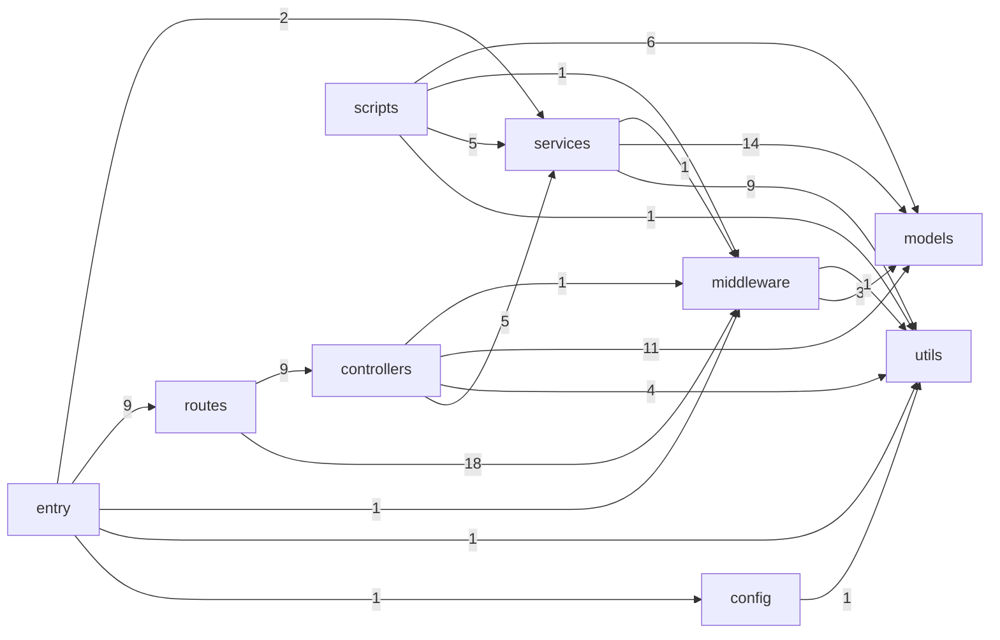
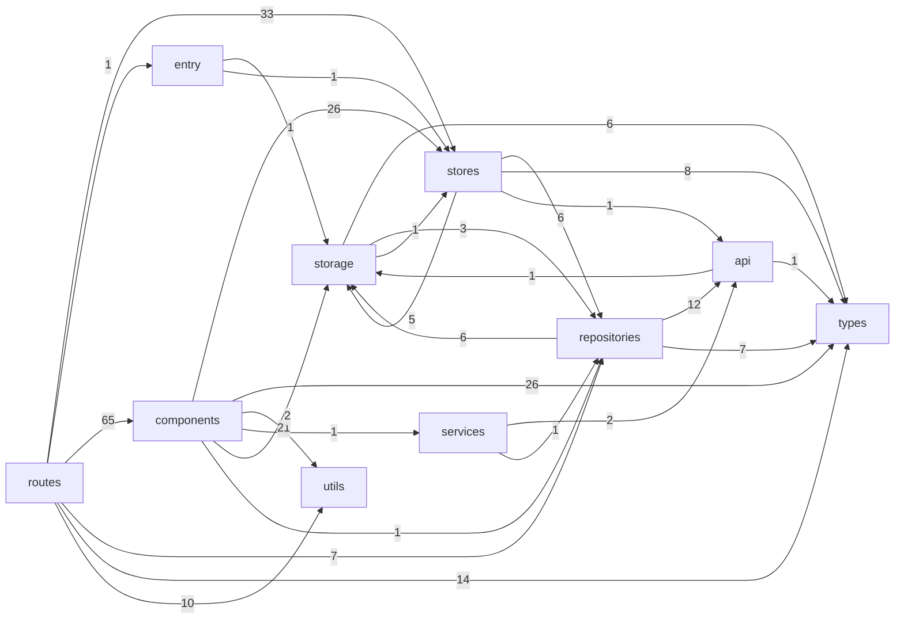

# Codebase Dependency Graph

_Generated by `.claude/skills/graphify` — a static import/require scan of `backend/src` and `frontend/src`. Re-run `node .claude/skills/graphify/scripts/generate-graph.js` after structural changes; this file is not watched automatically._

## backend

45 files scanned, 114 internal import edges found (10 within the same layer, omitted from the diagram below for readability).

**Most-depended-on files** (read these first — changing them has the widest blast radius):

- `backend/src/utils/logger.js` — imported by 16 modules
- `backend/src/middleware/auth.js` — imported by 8 modules
- `backend/src/models/User.js` — imported by 7 modules
- `backend/src/models/Task.js` — imported by 7 modules
- `backend/src/models/NotificationLog.js` — imported by 7 modules
- `backend/src/models/NotificationPreference.js` — imported by 6 modules
- `backend/src/middleware/validation.js` — imported by 6 modules
- `backend/src/services/emailService.js` — imported by 5 modules

## frontend

135 files scanned, 369 internal import edges found (100 within the same layer, omitted from the diagram below for readability).

**Most-depended-on files** (read these first — changing them has the widest blast radius):

- `frontend/src/lib/stores/lists.ts` — imported by 19 modules
- `frontend/src/lib/components/ui/Button.svelte` — imported by 18 modules
- `frontend/src/lib/components/ui/index.ts` — imported by 15 modules
- `frontend/src/lib/types/task.ts` — imported by 15 modules
- `frontend/src/lib/types/note.ts` — imported by 11 modules
- `frontend/src/lib/components/ui/Input.svelte` — imported by 10 modules
- `frontend/src/lib/types/list.ts` — imported by 9 modules
- `frontend/src/lib/utils/date.ts` — imported by 9 modules

## How this was built

The generator resolves relative (`./`, `../`) and `$lib/...` specifiers to real files via `require()`/`import ... from`/`export ... from`/dynamic `import()` regex extraction — no bundler, no execution. It intentionally ignores bare-specifier imports (npm packages, `svelte/store`, `$app/*`, etc.) since those are external to this repo's own module graph. Edges between `frontend` and `backend` are never inferred here because the two are separate npm projects that only talk over HTTP — see `frontend/src/lib/api/client.ts` and `backend/src/routes/` for that boundary.